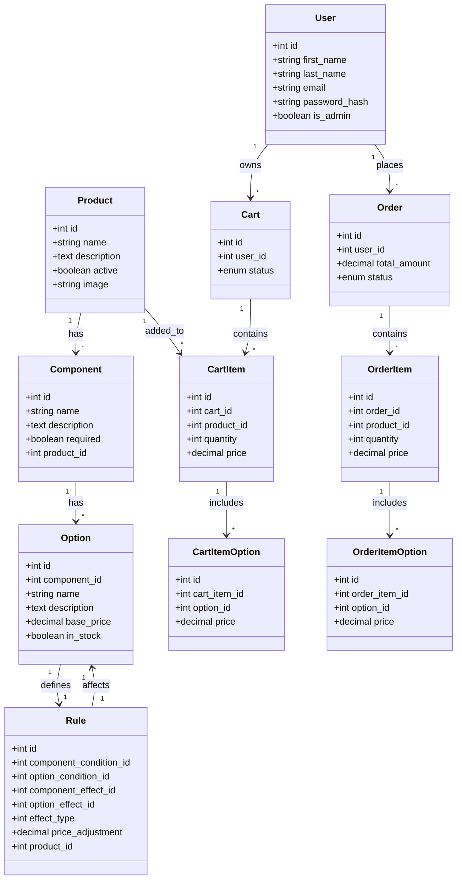

# Tech Challenge - Bicycle Shop

## 📋 1. Introduction
On this technical test the challenge was to build a website that allows a bicycle shop owner to sell his bicycles online.

The platform must manage various bicycle components with conditional dependencies between parts, track inventory status, and calculate dynamic pricing where certain combinations affect the final cost.

The system should also be scalable to accommodate future product beyond bicycles.
## 🛠️ 2. Tech Stack
### Backend
- Ruby on Rails
- MySQL
- REST API Structure

### Frontend
- React / Next.js
- Typescript
- Tailwind CSS

- Docker for containerization

> **Ruby:** 3.2
> **Rails:** 8.0.2
> **React:** 19
> **Next:** 15.2.4

## 🗃️ 3. DB Structure
I created the DB design as simple as possible, while making it sclabale and easy to grow and maintain.


###Main models:
- `users`: normal users(clients) and admin users
- `products`: bicycles, skis, surfboards ...
- `components`: the different parts of products: wheels, frame, color ...
- `options`: component possible choices
- `rules`: defines the behaviour between options of the same product. For example, if a option A of component X is picked by the user, then the option B of component Y is unavailable
- `carts`: shopping cart container the products customized by the users
- `orders`: orders placed by the users


## 📁 4. Project Structure

### Backend
The backend structure is pretty simple due to the low amount of models and therefore controllers.
```
api-backend/
├── app/
│   ├── controllers/
│   |   ├── api/        // main controllers
│   |   ├── users/      // devise token auth controllers
│   |   ├──api_controller.rb
│   |   └── application_controller.rb
│   ├── models/
│   └── uploaders/      // for uploading products photos

├── config/             // devise and CORS config
├── db/
│   ├── migrations/
│   └── schema.rb
└── ...
```
### Frontend
On the frontend I tried to maintain the cleanest structure possible while achieving:
- Clear separation between authentication, client and admin through Next.js route grouping
- Reusable components organised by purpose
- Centralized API communication with a dedicated lib
- Clean separation of concerns through isolated contexts and models

```
frontend/
├── public/
├── src/
│   ├── app/                        //pages
│   │   ├── (auth)/                 // auth pages (sign in, register...)
│   │   └── (shop)/
|   │       ├── (admin)/            //admin pages
│   |       └── products/           //client pages
│   ├── components/
│   │   ├── layout/
│   │   └── ui/
│   │   └── ...
│   ├── contexts/                   
│   ├── models/
│   └── lib/api.ts                  //for managing request and responses with token
├── package.json
└── ...
```
I want to make a special emphasis on the models folder, as each main model has the same folder structure:
```
user/
├── adapter/
├── domain/
└── infraestructure/
```
This approach creates a clear separation between business logic (domain), data access (infrastructure/repository), and integration layers (adapters). 

Also promotes maintainability through decoupling, facilitates easier testing of individual components, and enables seamless swapping of external dependencies without affecting core business logic.

## 👤 5. Main User Actions
Users can:
- Register and log in to the system
- Browse products
- Customize his own product by choosing the possible options
- View a summary of the chosen options and total price
- Add those customized products to the cart
- View on each moment the things that are on the cart
- Modify the cart by increasing the quantity of each product, adding or rmoving products
- Checkout the cart and creating an order

Admin Users can (in addition to the user actions):
- View all users and switching other users between admin or normal
- Browse, create and edit Products (name, description and image)
- Create, edit or delete Components (name, description and if it is required)
- Create, edit or delete Options (name, description, price and if has stock)
- Create edit and delete rules for every product,component and option (having verification for avoiding conflicting rules)
- Monitorize all orders (id, customer, status, amount, items, date)
- Browse and navigate over all models using search bar and pagination

## ⚙️ 6. Code Key Logic
### Create, edit and delete Products, Components and Options

### Rule verification (backend)

### Rule application (frontend)

### Cart workflow

## 💡 Future Implementations

## 📚 7. Additional Libraries and Gems
### Backend
- `devise-token-auth` - For user authentication
- `carrierwave` - For uploading photos

### Frontend
- `tailwind` - For UI design
- `lucide-react` - Purpose/functionality
> I decided to use Tailwid over Bootstrap even when I never used it before because of the templates and ui-kits provided by it. 

## 🔄 8. Git Management

## 🚀 9. Quick Start

1. Install Docker if you don't have it already.
2. Clone this repository and navigate to the root folder
3. Run the following command:

```bash
docker-compose up --build
```

3. Access the web:

    http://localhost:3001

### Test Credentials
- **Admin User** 👨‍💼
  - Email: admin@example.com
  - Password: password123

- **Regular User** 👤
  - Email: user@example.com
  - Password: password321

## 📄 License
CC BY-NC

## 👥 Author
Pau Hernando Màrmol